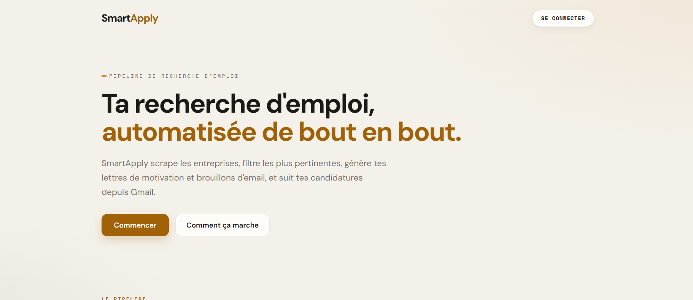
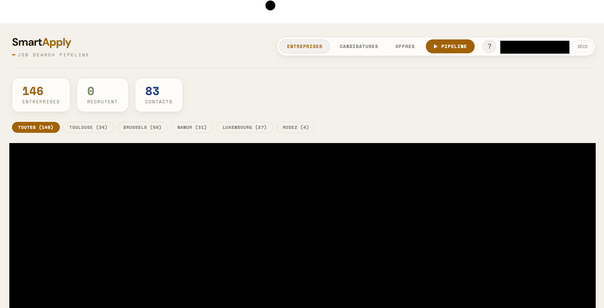

# SmartApply


[](https://sonarcloud.io/summary/new_code?id=MatthieuFranques_SmartApply)


> **SmartApply** automates the job-search pipeline: scrape companies → filter by relevance → enrich with website data → generate cover letters → track applications from Gmail.

---

| **Lead Explorer (Scraping)** | **Application Tracker (Gmail)** |
| :---: | :---: |
|  |  |

---

## Key Features

### 1. Smart Job Discovery & Enrichment
- **Targeted Scraping**: Finds tech companies by city and sector via Google Maps
- **AI Filtering**: Two-pass filter — fast keyword/DNS pre-score + Ollama deep score
- **Company Enrichment**: Scrapes company websites for tech keywords and recruiting signals
- **Hunter.io Integration**: Domain discovery and email verification

### 2. External Job Offers
- **Indeed RSS + Adzuna** aggregation with 12h cache and 90-day persistence
- Deduplication across sources
- Combined view: pipeline enriched companies + external offers

### 3. Privacy-First AI Generation
- **RAG-powered letters**: ChromaDB retrieves relevant CV chunks + past letters as context
- **Tailored output**: targeted (job offer found), spontaneous, or contact form mode
- **100% local inference**: Ollama runs on your host — your data never leaves your machine
- **Gmail drafts**: generated letters sent directly to Gmail Drafts

### 4. Application Tracker
- Syncs Gmail `Candidatures` label automatically
- Hybrid parser: regex for obvious cases, Ollama for ambiguous ones
- Status tracking: `Offre reçue > Entretien > Refusé > Décision requise > En attente`

### 5. Microservices Architecture
- 5 independent FastAPI services behind an nginx gateway
- Each service has its own memory budget and can be scaled independently
- All pipeline stages stream via SSE for real-time UI updates

---

## Quick Start

```bash
# 1. Start Ollama on your host
ollama pull mistral
ollama pull nomic-embed-text

# 2. Configure environment (copy .env.example files, fill in credentials)
cp src/SmartApplyAuth/.env.example src/SmartApplyAuth/.env
# ... repeat for each service

# 3. Start the stack
docker-compose up --build

# 4. Start the frontend (dev mode)
cd src/SmartApplyFront && npm install && ng serve

# 5. Open the app
# http://localhost:4200  (frontend)
# http://localhost       (gateway + API)
```

See [SETUP.md](docs/SETUP.md) for the full guide.

---

## Documentation

| Document | Description |
|---|---|
| [SETUP.md](docs/SETUP.md) | Full installation guide — Docker, Ollama, env vars |
| [ARCHITECTURE.md](docs/ARCHITECTURE.md) | System design, service map, data flows |
| [MICROSERVICES.md](docs/MICROSERVICES.md) | Complete API reference for all microservices |
| [CONTRIBUTING.md](docs/CONTRIBUTING.md) | Git Flow, commit conventions, project structure |
| [GUIDE_OLLAMA.md](docs/GUIDE_OLLAMA.md) | Ollama setup, model selection, RAG flow |
| [SECURITY.md](docs/SECURITY.md) | Auth, secret management, deployment notes |
| [ROADMAP.md](docs/ROADMAP.md) | Completed phases and upcoming features |
| [LICENSE.md](docs/LICENSE.md) | MIT License |
