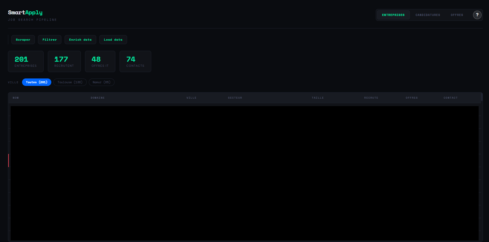
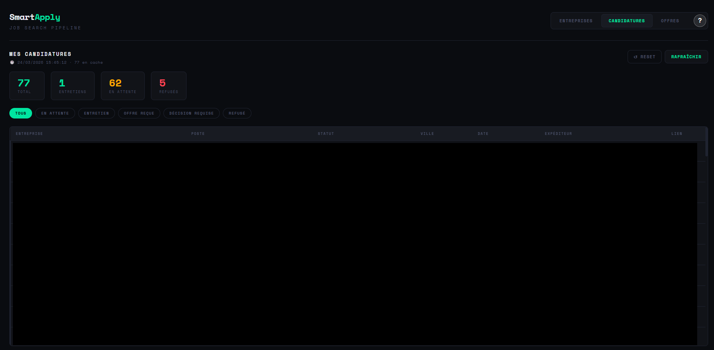

# SmartApply

> **SmartApply** is a job search optimization tool that automates company scraping, prospect filtering, data enrichment, and cover letter generation using AI.

---
---
| **Lead Explorer (Scraping)** | **Application Tracker (Gmail)** |
| :---: | :---: |
|  |  |
---

## Key Features

###  1. Smart Job Discovery & Enrichment
* **Targeted Scraping**: Integrated with the **Hunter.io API** to find and verify key contact information.
* **Data Filtering**: Advanced filtering logic to keep only the most relevant leads.
* **Company Enrichment**: Automatically fetches additional context about companies to give you a competitive edge before applying.

###  2. Dual-Core Dashboard
* **Lead Explorer**: A dedicated view to manage and analyze newly scraped companies.
* **Application Tracker**: A separate dashboard to monitor your active applications, follow-ups, and Gmail interactions.

###  3. Privacy-First AI Generation
* **Context-Aware Drafting**: Automatically generates tailored cover letters by analyzing the specific context of the company and the job role.
* **100% Local Inference**: Powered by **Ollama**, ensuring that your professional data and CVs never leave your local machine.

###  4. Seamless Developer Experience
* **Containerized Stack**: Fully Dockerized environment (Angular + FastAPI) for a "one-command" setup.

## Project Documentation

To make the setup and contribution process easier, please refer to the following documents:

| Document | Description |
| :--- | :--- |
|  **[SETUP.md](docs/SETUP.md)** | Step-by-step installation with Docker & Ollama. |
|  **[CONTRIBUTING.md](docs/CONTRIBUTING.md)** | Git Flow, Commit conventions, and coding standards. |
|  **[SECURITY.md](docs/SECURITY.md)** | Privacy policy and local data management. |
|  **[ROADMAP.md](docs/ROADMAP.md)** | Upcoming features and project vision. |
|  **[GUIDE_OLLAMA.md](docs/GUIDE_OLLAMA.md)** | Deep dive into local AI configuration. |
| **[SECURITY.md](docs/SECURITY.md)** | Privacy policy and local data management. |
|  **[LICENSE.md](docs/LICENSE.md)** | MIT License and legal protections. |

