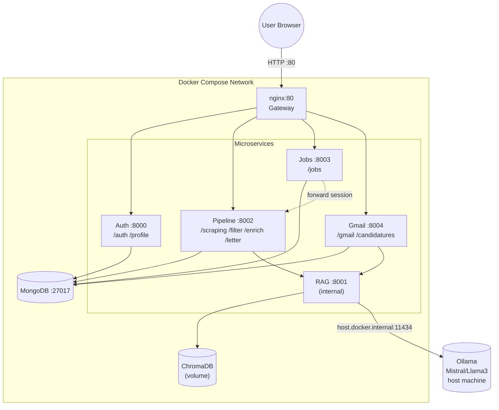

# System Architecture

This document describes the high-level architecture of **SmartApply**.

## Component Overview

| Component | Technology | Role |
|---|---|---|
| Frontend | Angular 18 SPA | UI — pipeline dashboard + application tracker |
| Gateway | nginx 1.27 | Reverse proxy, single entry point on port 80 |
| Auth | FastAPI (Python 3.11) — port 8000 | Google OAuth2, JWT sessions, user profile |
| Pipeline | FastAPI (Python 3.11) — port 8002 | Scraping → filter → enrich → letter generation |
| Jobs | FastAPI (Python 3.11) — port 8003 | External job offers (Indeed RSS, Adzuna) |
| Gmail | FastAPI (Python 3.11) — port 8004 | Gmail integration, application sync |
| RAG | FastAPI (Python 3.11) — port 8001 | Vector store + Ollama-powered letter generation |
| MongoDB | mongo:7 — port 27017 | Shared database for all services |
| Ollama | Native on host | Local LLM inference (Mistral / Llama3) |

## Architecture Diagram



## Request Flow

```
Browser → nginx:80 → [auth|pipeline|jobs|gmail]:port → MongoDB
                                ↓
                        pipeline / gmail → rag:8001 → ChromaDB + Ollama
```

## nginx Route Table

| URL prefix | Upstream service |
|---|---|
| `/auth`, `/profile` | `auth:8000` |
| `/scraping`, `/filter`, `/enrich`, `/pipeline`, `/letter` | `pipeline:8002` |
| `/jobs` | `jobs:8003` |
| `/gmail`, `/candidatures` | `gmail:8004` |

> The RAG service (`rag:8001`) is **not exposed through nginx** — it is internal-only.

## Pipeline Data Flow

Jobs flow through stages in MongoDB `jobs` collection, keyed on `(user_id, domaine)`:

```
scraping → filtered → deep → enriched
```

Each stage has status `active` or `eliminated`. The pipeline uses **SSE streaming** — every router returns a `StreamingResponse(media_type="text/event-stream")` that yields JSON events, terminating with `{"type": "done"}`.

The Angular `PipelineService` chains stages using RxJS `concat`, waiting for each SSE stream to complete before starting the next.

## Auth Flow

```
GET /auth/login
  → redirect to Google OAuth2 consent

GET /auth/callback?code=...
  → exchange code for tokens
  → upsert user in MongoDB
  → create JWT (subject = google_id)
  → set HttpOnly session cookie (7 days)
  → redirect to frontend
```

All protected routes use `Depends(get_current_user)` — decodes JWT, loads User from MongoDB.

## RAG Architecture

The RAG service (ChromaDB + Ollama) is called by both `pipeline` and `gmail`:

```
1. retrieve/context  → fetch relevant chunks from ChromaDB
                        (CV chunks + past letters + reference letters)
2. build prompt      → context + company data + user profile
3. Ollama 2-pass:
   - analysis prompt  (temp 0.3)
   - letter generation (temp 0.7)
4. index/letter      → store generated letter back in ChromaDB
```

## Why Microservices?

Each service has a single responsibility and independent memory budget:
- `auth` (256M) — lightweight, stateless JWT validation
- `pipeline` (512M) — heavy scraping + AI filtering
- `jobs` (256M) — external API aggregation
- `gmail` (256M) — Gmail sync + Ollama parsing
- `rag` (512M) — ChromaDB + Ollama generation
- `mongodb` (512M) — database

Total: ~2.3 GB max. Each service scales independently.

[← Back to Main README](../README.md)
