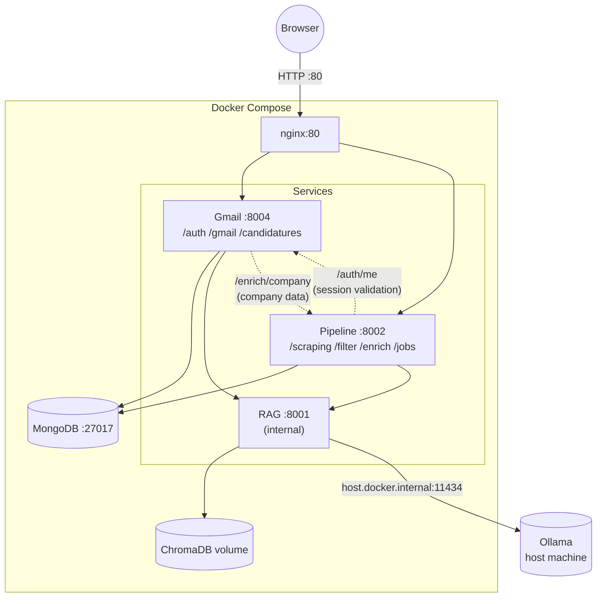

# System Architecture

## Components

| Component | Technology | Role |
|---|---|---|
| Frontend | Angular 18 | Pipeline dashboard + application tracker |
| Gateway | nginx 1.27 | Reverse proxy, port 80 |
| Gmail | FastAPI (Python 3.11) — port 8004 | Auth + Gmail + application sync |
| Pipeline | FastAPI (Python 3.11) — port 8002 | Scraping + filter + enrich + jobs |
| RAG | FastAPI (Python 3.11) — port 8001 | Vector store + Ollama letter generation |
| MongoDB | mongo:7 — port 27017 | Shared database |
| Ollama | Native on host | Local LLM inference (Mistral / Llama3) |

## Architecture Diagram



## Request Flow

```
Browser → nginx:80 → [gmail|pipeline]:port → MongoDB
                            ↓
                    pipeline/gmail → rag:8001 → ChromaDB + Ollama

Inter-service (internal HTTP):
  pipeline → gmail:8004/auth/me           (session validation)
  gmail    → pipeline:8002/enrich/company (company data for drafts)
```

## nginx Route Table

| URL prefix | Upstream |
|---|---|
| `/auth`, `/profile`, `/gmail`, `/candidatures` | `gmail:8004` |
| `/scraping`, `/filter`, `/enrich`, `/pipeline`, `/letter`, `/jobs` | `pipeline:8002` |

> RAG (`rag:8001`) not exposed through nginx — internal only.

## Pipeline Data Flow

```
scraping → filtered → deep → enriched
```

Keyed on `(user_id, domaine)` in MongoDB `jobs` collection. All pipeline endpoints use SSE streaming (`text/event-stream`), terminating with `{"type": "done"}`.

## Auth Flow

```
GET /auth/login
  → redirect to Google OAuth2

GET /auth/callback?code=...
  → exchange code for tokens
  → upsert user in MongoDB
  → set HttpOnly session cookie (7 days, JWT signed with JWT_SECRET_KEY)
  → redirect to frontend

Pipeline auth: forwards session cookie → gmail:8004/auth/me → returns AuthUser
```

## Why 3 Services?

| Service | Memory | Responsibility |
|---|---|---|
| gmail | 256M | Auth + Gmail API (I/O bound) |
| pipeline | 512M | Scraping + AI filtering (CPU/memory heavy) |
| rag | 512M | ChromaDB + Ollama generation |
| mongodb | 512M | Database |

Total: ~1.8 GB max. Each service scales independently.

[← Back to Main README](../README.md)
